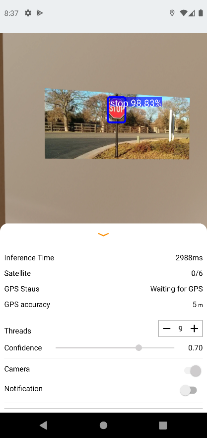

# Portfolio
---

## Deep Learning

### Web App for Real-time Human Activity Recognition Using Deep Learning  

_Key Skills: Data Analysis · Data Science · Artificial Intelligence (AI) · Deep Learning · Feature Engineering · Research Skills · Python (Programming Language) · Pandas · NumPy · SciPy · Matplotlib · Keras · TensorFlow · Flask · Web Applications · Firebase · Cloud Firestore · Convolutional Neural Networks (CNN) · Long Short-term Memory (LSTM) · Google Cloud Platform (GCP)_
 

 

<b>Objective:</b>
 
Design a deep learning model to recognize human activities (walking, running, sitting, etc.) in real-time using data collected from sensors. 

<b>Tasks:</b>
 
-Identified and selected appropriate sensors (e.g., accelerometers, gyroscopes) that capture relevant data for activity recognition. 
-Collected real-time sensor data corresponding to various human activities. 
-Pre-processed the sensor data to ensure consistency and remove noise. 
-Designed and implemented multiple deep learning models suitable for processing sequential sensor data including Convolution Neural Networks (CNNs), Recurrent Neural Networks (RNNs). Long Short-Term Memory (LSTM) networks, and CNN-LSTM networks. 
-Trained the models on the labeled sensor data for real-time activity recognition. 
-Optimized the model for accuracy, efficiency, and low latency to enable real-time operation. 
-Tested and evaluated the model's performance in real-time scenarios. 
-Developed a web app to display the model prediction results in real-time in a user-friendly interface. 

 

 

 

 

---
### Web App for Real-time Human Activity Recognition Using Deep Learning  

_Key Skills: Data Analysis · Data Science · Artificial Intelligence (AI) · Deep Learning · Feature Engineering · Research Skills · Python (Programming Language) · Pandas · NumPy · SciPy · Matplotlib · Keras · TensorFlow · Flask · Web Applications · Firebase · Cloud Firestore · Convolutional Neural Networks (CNN) · Long Short-term Memory (LSTM) · Google Cloud Platform (GCP)_
 

 

<b>Objective:</b>
 
Design a deep learning model to recognize human activities (walking, running, sitting, etc.) in real-time using data collected from sensors. 

<b>Tasks:</b>
 
-Identified and selected appropriate sensors (e.g., accelerometers, gyroscopes) that capture relevant data for activity recognition. 
-Collected real-time sensor data corresponding to various human activities. 
-Pre-processed the sensor data to ensure consistency and remove noise. 
-Designed and implemented multiple deep learning models suitable for processing sequential sensor data including Convolution Neural Networks (CNNs), Recurrent Neural Networks (RNNs). Long Short-Term Memory (LSTM) networks, and CNN-LSTM networks. 
-Trained the models on the labeled sensor data for real-time activity recognition. 
-Optimized the model for accuracy, efficiency, and low latency to enable real-time operation. 
-Tested and evaluated the model's performance in real-time scenarios. 
-Developed a web app to display the model prediction results in real-time in a user-friendly interface. 

 

 

 

 

---
### Driving Assistant (Copilot) Android App for Street Sign Detection and Identification in Real-time  

_Key Skills: Android · Android Development · Android Studio · Android SDK · Kotlin · Data Science · Data Analysis · Convolutional Neural Networks (CNN) · Pandas · NumPy · Matplotlib · Python (Programming Language) · Deep Learning · Data Classification_
 

 

 

<b>Objective:</b>
 
Develop a copilot app leveraging a deep learning model to enhance driving safety by detecting and identifying street signs in real-time from live mobile camera feeds, alerting drivers to speed limits and hazards, promoting adherence to traffic laws, and reducing accidents and congestion. 

<b>Tasks:</b>
 
-Researched and selected appropriate deep learning models focusing on Convolutional Neural Networks (CNNs) pre-trained for object detection tasks like YOLO. 
-Analyzed a large dataset of street sign images encompassing various types, shapes, and environmental conditions (lighting variations, occlusions). 
-Pre-processed the image data for training the deep learning model, including techniques such as image resizing, normalization, and data augmentation. 
-Adapted the chosen deep learning model for street sign detection and classification by fine-tuning it on the prepared street sign image dataset. 
-Integrated the deep learning model with an Android application framework for real-time processing. 
-Developed functionalities within the app to capture live video from the smartphone camera and to calculate the car’s speed using GPS. 
-Designed an interface to display real-time detections and classifications of street signs on the phone screen with audio alerts for critical signs (stop signs, speed limit signs). 
-Optimized the app for performance on mobile devices, balancing accuracy with computational efficiency and battery usage. 

 

 

 

 

---
## Machine Learning

### Web App for Real-time Indoor Positioning System using Machine Learning   

_Key Skills: Machine Learning · Feature Engineering · Scikit-Learn · Data Science · Data Analysis · Artificial Intelligence (AI) · Communication Protocols · Internet of Things (IoT) · Python (Programming Language) · NumPy · Pandas · Matplotlib · Data Classification · Flask · Web Applications · Firebase · Cloud Firestore · Google Cloud Platform (GCP)_
 

 

<b>Objective:</b>
 
Develop a real-time indoor positioning system using machine learning techniques, replacing GPS due to its inaccuracy in indoor environments. 

<b>Tasks:</b>
 
-Investigated different indoor positioning technologies, especially Bluetooth Low Energy (BLE) beacons. 
-Collected data points (signal strengths, received signal strength indicator (RSSI) values) from the chosen technology within the designated indoor space. 
-Employed various machine learning algorithms such k-Nearest Neighbors (kNN), Support Vector Machines (SVMs), Random Forest, Naive Bayes, etc. to learn the relationship between signal data and location. 
-Trained several models to predict a user's location based on real-time sensor data readings. 
-Evaluated the positioning system's accuracy and latency for real-time applications. 
-Optimized the model for efficient resource utilization and real-time performance.
 

 

 

 

 

 

 
---

© 2024 Amr Alfayoumy. Powered by Jekyll and the Minimal Theme.
