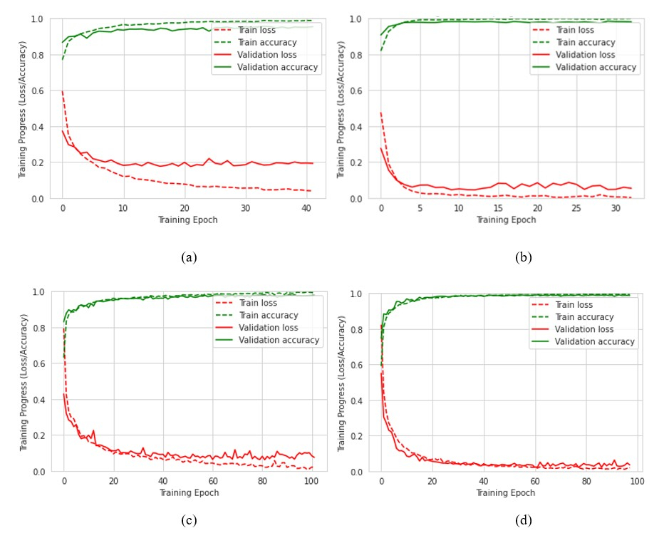
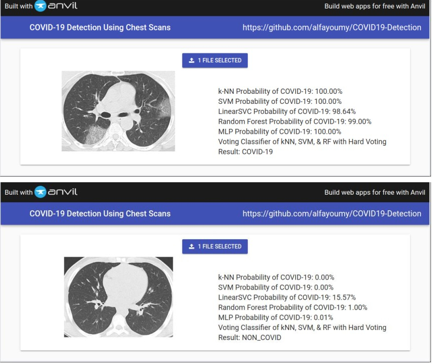

# Portfolio
---

## [Deep Learning](#deep-learning) · [Machine Learning](#machine-learning) · [Data Visualization](#data-visualization)

---

## Deep Learning

### Web App for Real-time Human Activity Recognition Using Deep Learning  

_Key Skills: Data Analysis · Data Science · Artificial Intelligence (AI) · Deep Learning · Feature Engineering · Research Skills · Python (Programming Language) · Pandas · NumPy · SciPy · Matplotlib · Keras · TensorFlow · Flask · Web Applications · Firebase · Cloud Firestore · Convolutional Neural Networks (CNN) · Long Short-term Memory (LSTM) · Google Cloud Platform (GCP) · NoSQL · JSON Web Tokens (JWT) · OAuth · RESTful APIs · Git · Agile Methodology_
 

<i>HAR System Overview</i>

 

<b>Objective: </b>
Design a deep learning model to recognize human activities (walking, running, sitting, etc.) using data collected from sensors on a wearable device and develop a web app to monitor human activities in real-time for the application of a patient monitoring in the setting of a care-facility for the elderly. 
 
<b>Tasks:</b>
 
<ul>
    <li>Identified and selected appropriate sensors (e.g., accelerometers, gyroscopes) that capture relevant data for activity recognition.</li>
    <li>Collected real-time sensor data corresponding to various human activities.</li>
    <li>Pre-processed the sensor data to ensure consistency and remove noise.</li>
    <li>Designed and implemented multiple deep learning models suitable for processing sequential sensor data including Convolution Neural Networks (CNNs), Recurrent Neural Networks (RNNs). Long Short-Term Memory (LSTM) networks, and CNN-LSTM networks.</li>
    <li>Trained the models on the labeled sensor data for real-time activity recognition.</li>
    <li>Optimized the model for accuracy, efficiency, and low latency to enable real-time operation.</li>
    <li>Tested and evaluated the model's performance in real-time scenarios.</li>
    <li>Developed a web app to monitor human activities and display the models prediction results in real-time in a user-friendly interface.</li>
</ul>

     
    <i>Accuracy and loss curves of (a) ANN, (b) CNN, (c) LSTM, (d) CNN-LSTM</i>
      
     
    <i>HAR models' performance metrics</i>
      
     
    <i>Web app dashboard showing the prediction of each HAR model</i>
      
    

---
### Real-time Detection of Cyberattacks on Secure Water Treatment Plants (SWaT) \[Work in Progress\] 

_Key Skills: Data Science · Artificial Intelligence (AI) · Data Analysis · Deep Learning · Internet of Things (IoT) · Python (Programming Language) · Pandas · Anaconda · Seaborn · SciPy · NumPy · Matplotlib · Keras · TensorFlow · Binary Classification · Anomaly Detection · Multi-label Classification · Multi-step Forecasting · Multivariate Time Series Forecasting · Convolutional Neural Networks (CNN) · Long Short-term Memory (LSTM) · Gated Recurrent Units (GRUs) · Bidirectional Recurrent Neural Networks (Bi-RNNs)_
 

<i>Overview of the Secure Water Treatment (SWaT) plant</i>

 

<b>Objective: </b>
Develop a real-time detection system using deep learning to identify malfunctions and cyberattacks in secure water treatment plants (SWaTs), integrating historical data analysis, predictive modeling, and real-time monitoring to provide timely insights and alerts for informed decision-making by plant operators. 
 
<b>Tasks:</b>
 
<ul>
    <li>Identified the relevant sensors and actuators within the secure treatment plant, understanding the data they generate (e.g., flow rates, chemical levels, actuator status, etc.).</li>
    <li>Analyzed historical sensor and actuator data alongside information on normal operational states and any past attacks.</li>
    <li>Pre-processed the data to handle missing values, and outliers, and ensure data quality and integrity.</li>
    <li>Developed deep learning models to classify and forecast sensor and actuator data in real time.</li>
    <li>Trained the models to identify normal operational patterns and potential deviations that could indicate a cyberattack as well as identify the exact time of the cyberattack and attack points.</li>
    <li>Optimized the deep learning models by fine-tuning hyperparameters, adjusting architectures, and implementing advanced techniques such as regularization and dropout to improve performance and generalization.</li> 
    <li>Evaluated the models' ability to detect anomalies and predict potential cyberattacks on the system.</li>
</ul>

     
    <i>Confusion matrices of the Normal vs. Attack classification task of (a) LSTM, (b) CNN, (c) CNN-LSTM models</i>
      
     
    <i>Models' performance metrics on the Normal vs. Attack classification task</i>
      
     
    <i>Models' performance metrics on the Attack Points multilabel classification task</i>
      
    

---
### Driving Assistant (Copilot) Android App for Street Sign Detection and Identification in Real-time  

_Key Skills: Android · Android Development · Android Studio · Android SDK · Kotlin · Data Science · Data Analysis · Convolutional Neural Networks (CNN) · Pandas · NumPy · Matplotlib · Python (Programming Language) · Deep Learning · Data Classification · OpenCV · TensorFlow Lite · Image Processing · Mobile Development · UI/UX Design · Unit Testing · Continuous Integration and Deployment (CI/CD)_
 

<i>High-level design of the app</i>

 

<i>Interacting components of the system</i>

 

<b>Objective:</b>
Develop a copilot app leveraging a deep learning model to enhance driving safety by detecting and identifying street signs in real-time from live mobile camera feeds, alerting drivers to speed limits and hazards, promoting adherence to traffic laws, and reducing accidents and congestion. 
 
<b>Tasks:</b>
 
<ul>
    <li>Researched and selected appropriate deep learning models focusing on Convolutional Neural Networks (CNNs) pre-trained for object detection tasks like YOLO.</li>
    <li>Analyzed a large dataset of street sign images encompassing various types, shapes, and environmental conditions (lighting variations, occlusions).</li>
    <li>Pre-processed the image data for training the deep learning model, including techniques such as image resizing, normalization, and data augmentation.</li>
    <li>Adapted the chosen deep learning model for street sign detection and classification by fine-tuning it on the prepared street sign image dataset.</li>
    <li>Integrated the deep learning model with an Android application framework for real-time processing.</li>
    <li>Developed functionalities within the app to capture live video from the smartphone camera and to calculate the car’s speed using GPS.</li>
    <li>Designed an interface to display real-time detections and classifications of street signs on the phone screen with audio alerts for critical signs (stop signs, speed limit signs).</li>
    <li>Optimized the app for performance on mobile devices, balancing accuracy with computational efficiency and battery usage.</li>
</ul>

     
    <i>Proposed design</i>
      
     
    <i>Model predicted labels vs. true labels for an eval batch. Green indicates correct predictions whereas red indicates wrong predictions.</i>
      
     
    <i>The developed app under testing through AVM</i>
      
    

---

## Machine Learning

### Supervised Algorithms for the Detection of COVID-19 from Chest CT & X-ray Scan Images  

_Key Skills: Machine Learning · Feature Engineering · Feature Extraction · Image Processing · Digital Image Processing · Data Classification · Scikit-Learn · Matplotlib · SciPy · NumPy · Pandas · OpenCV · Python (Programming Language) · Web Applications  · Hyperparameter Tuning · Cross-validation_
 

<i>Proposed model overview</i>

 

<b>Objective:</b>
 
 Develop a supervised machine learning model to automate the analysis of X-ray and CT scan images for faster and more efficient detection of COVID-19. 
 
<b>Tasks:</b>
 
<ul>
    <li>Collected and pre-processed a large dataset of X-ray and CT scans, including both COVID-19 positive and negative cases.</li>
    <li>Implemented image processing techniques to extract relevant features (HSV Histograms, Haralick Texture Features, Threshold Adjacency Statistics, Raw Pixel Intensities, etc.) from the X-ray and CT scan images.</li>
    <li>Employed supervised machine learning algorithms, focusing on algorithms effective for classification tasks such as K-Nearest Neighbors (kNN), Support Vector Machines (SVMs), Random Forests, etc.</li>
    <li>Trained and validated the model on the prepared dataset, optimizing for accuracy in differentiating between COVID-19 and other respiratory illnesses.</li>
    <li>Evaluated the model's performance metrics such as sensitivity, specificity, and accuracy.</li>
    <li>Documented the research process, highlighting the chosen feature extraction techniques, machine learning algorithms used, training parameters, and achieved performance.</li>
</ul>

     
    <i>Confusion matrix of the Voting Classifier on the combined features of the CT model (left) and X-ray model (right).</i>
      
     
    <i>Testing accuracies of the classifying algorithms on the CT dataset</i>
      
     
    <i>Testing accuracies of the classifying algorithms on the X-ray dataset</i>
      
     
    <i>The proposed model tested through the web app on a CT scan image of a COVID-19 positive case (above) and a CT scan image of a COVID-19 negative case (below).</i>
      
    
    <i>The proposed model tested through the web app on a CT scan image of a COVID-19 positive case (above), a CT scan image of a viral pneumonia case (middle), and a CT scan image of a normal lung (below).</i>
      
    

    
---
### Real-time Indoor Positioning System using Machine Learning  

_Key Skills: Machine Learning · Feature Engineering · Scikit-Learn · Data Science · Data Analysis · Artificial Intelligence (AI) · Communication Protocols · Signal Processing · Internet of Things (IoT) · Python (Programming Language) · NumPy · Pandas (Software) · Matplotlib · Data Classification · Flask · Web Applications · Firebase · Cloud Firestore · Google Cloud Platform (GCP) · Cross-validation · Agile Methodology_
 

<i>IPS Overview</i>

 

<b>Objective:</b>
Develop a real-time indoor positioning system using machine learning techniques to accurately predict a user's location within a designated indoor space based on signal data collected from Bluetooth Low Energy (BLE) beacons or similar technologies. 
 
<b>Tasks:</b>
 
<ul>
    <li>Investigated different indoor positioning technologies, and selected Bluetooth Low Energy (BLE) beacons for this application.</li>
    <li>Collected data points (received signal strength indicator (RSSI) values) from the chosen technology within the designated indoor space.</li>
    <li>Employed various machine learning algorithms such k-Nearest Neighbors (kNN), Support Vector Machines (SVMs), Random Forest, Naive Bayes, and others to learn the relationship between signal data and location.</li>
    <li>Trained several models to predict a user's location within the designated space based on real-time BLE RSSI readings.</li>
    <li>Evaluated the positioning system's accuracy and latency for real-time applications.</li>
    <li>Optimized the models for efficient resource utilization and real-time performance.</li>
    <li>Integrated the Indoor Positioning System with the Human Activity Recognition system for the application of patient monitoring in a care facility for the elderly.</li>
    <li>Configured the system to detect inconsistent events (e.g., patient laying down in the bathroom) and alarming activities (e.g., location and activity have not changed for a period of time) and send alerts when an event is detected.</li>
    <li>Documented the research process and presented the findings to technical and non-technical audiences.</li>
</ul>

    
    <i>Sequence diagram of the integrated HAR-IPS system</i>
      
     
    <i>IPS models' performance metrics</i>
      
     
    <i>Web app dashboard showing the prediction of each IPS model</i>
      
     
    <i>Web app dashboard showing the patient's location inside the designated space</i>
      
     
     
    <i>Event detection and warning message on the Web app (above) with an email alert notification (below)</i>
      
    

---

## Data Visualization

### COVID-19 Dashboard using BigQuery and Looker Studio  

_Key Skills: Machine Learning · Feature Engineering · Scikit-Learn · Data Science · Data Analysis · Artificial Intelligence (AI) · Communication Protocols · Signal Processing · Internet of Things (IoT) · Python (Programming Language) · NumPy · Pandas (Software) · Matplotlib · Data Classification · Flask · Web Applications · Firebase · Cloud Firestore · Google Cloud Platform (GCP) · Cross-validation · Agile Methodology_
 

<i>COVID-19 Dashboard Thumbnail</i>

 

<b>Objective:</b>
The objective of this project is to utilize Google BigQuery to extract relevant data from the COVID-19 Open Data dataset and then leverage Google Data Studio (Looker Studio) to create an interactive dashboard. This dashboard aims to visualize valuable insights and trends related to COVID-19, including confirmed cases, deaths, vaccination rates, fatality rates, recovery rates, etc. across different countries and over time. 
 

<b>Tasks:</b>
 
<ul>
    <li>Extracted valuable data from the COVID-19 Open Data dataset using Google BigQuery.</li>
    <li>Analyzed the extracted data to identify key metrics and trends relevant to the COVID-19 pandemic, such as total confirmed cases, total deaths, fatality rates, vaccination rates, etc.</li>
    <li>Designed and built an interactive dashboard from scratch using Google Data Studio.</li>
    <li>Integrated various visualizations, including maps, tables, charts, and graphs, to effectively communicate insights and trends.</li>
    <li>Implemented user-friendly features such as dropdown menus for selecting specific countries and date ranges to enable dynamic data exploration.</li>
    <li>Ensured data accuracy and reliability by validating the data sources and updating the dashboard regularly with the latest available data.</li>
    <li>Tested the dashboard functionality to ensure smooth interaction and proper display of information across different devices and platforms.</li>
    <li>Provided documentation to enable users to understand how to interpret and utilize the dashboard effectively for decision-making and analysis.</li>
</ul>

© 2024 Amr Alfayoumy. Powered by Jekyll and the Minimal Theme.
