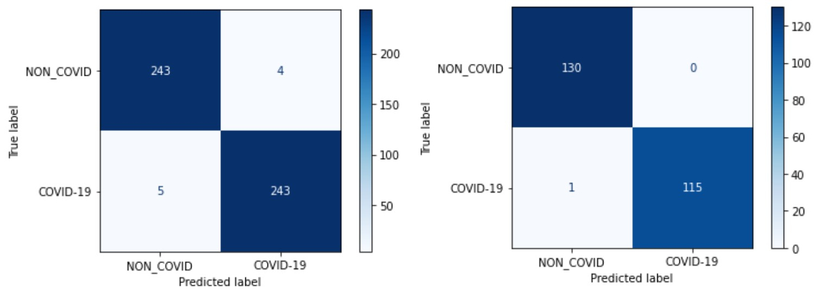

# Portfolio
---

## Deep Learning

### Web App for Real-time Human Activity Recognition Using Deep Learning  

_Key Skills: Data Analysis · Data Science · Artificial Intelligence (AI) · Deep Learning · Feature Engineering · Research Skills · Python (Programming Language) · Pandas · NumPy · SciPy · Matplotlib · Keras · TensorFlow · Flask · Web Applications · Firebase · Cloud Firestore · Convolutional Neural Networks (CNN) · Long Short-term Memory (LSTM) · Google Cloud Platform (GCP)_
 

<i>HAR system overview</i>

 

<b>Objective: </b>
Design a deep learning model to recognize human activities (walking, running, sitting, etc.) in real-time using data collected from sensors. 
 
<b>Tasks:</b>
 
<ul>
    <li>Identified and selected appropriate sensors (e.g., accelerometers, gyroscopes) that capture relevant data for activity recognition.</li>
    <li>Collected real-time sensor data corresponding to various human activities.</li>
    <li>Pre-processed the sensor data to ensure consistency and remove noise.</li>
    <li>Designed and implemented multiple deep learning models suitable for processing sequential sensor data including Convolution Neural Networks (CNNs), Recurrent Neural Networks (RNNs). Long Short-Term Memory (LSTM) networks, and CNN-LSTM networks.</li>
    <li>Trained the models on the labeled sensor data for real-time activity recognition.</li>
    <li>Optimized the model for accuracy, efficiency, and low latency to enable real-time operation.</li>
    <li>Tested and evaluated the model's performance in real-time scenarios.</li>
    <li>Developed a web app to display the model prediction results in real-time in a user-friendly interface.</li>
</ul>

 
<i>Accuracy and loss curves of (a) ANN, (b) CNN, (c) LSTM, (d) CNN-LSTM</i>
  
 
<i>Models' performance metrics</i>
  
 
<i>Web app dashboard includes the prediction of each HAR model</i>
  

---
### Web App for Real-time Human Activity Recognition Using Deep Learning  

_Key Skills: Data Analysis · Data Science · Artificial Intelligence (AI) · Deep Learning · Feature Engineering · Research Skills · Python (Programming Language) · Pandas · NumPy · SciPy · Matplotlib · Keras · TensorFlow · Flask · Web Applications · Firebase · Cloud Firestore · Convolutional Neural Networks (CNN) · Long Short-term Memory (LSTM) · Google Cloud Platform (GCP)_
 

<i>HAR system overview</i>

 

<b>Objective: </b>
Design a deep learning model to recognize human activities (walking, running, sitting, etc.) in real-time using data collected from sensors. 
 
<b>Tasks:</b>
 
<ul>
    <li>Identified and selected appropriate sensors (e.g., accelerometers, gyroscopes) that capture relevant data for activity recognition.</li>
    <li>Collected real-time sensor data corresponding to various human activities.</li>
    <li>Pre-processed the sensor data to ensure consistency and remove noise.</li>
    <li>Designed and implemented multiple deep learning models suitable for processing sequential sensor data including Convolution Neural Networks (CNNs), Recurrent Neural Networks (RNNs). Long Short-Term Memory (LSTM) networks, and CNN-LSTM networks.</li>
    <li>Trained the models on the labeled sensor data for real-time activity recognition.</li>
    <li>Optimized the model for accuracy, efficiency, and low latency to enable real-time operation.</li>
    <li>Tested and evaluated the model's performance in real-time scenarios.</li>
    <li>Developed a web app to display the model prediction results in real-time in a user-friendly interface.</li>
</ul>

 
<i>Accuracy and loss curves of (a) ANN, (b) CNN, (c) LSTM, (d) CNN-LSTM</i>
  
 
<i>Models' performance metrics</i>
  
 
<i>Web app dashboard includes the prediction of each HAR model</i>
  

---
### Driving Assistant (Copilot) Android App for Street Sign Detection and Identification in Real-time  

_Key Skills: Android · Android Development · Android Studio · Android SDK · Kotlin · Data Science · Data Analysis · Convolutional Neural Networks (CNN) · Pandas · NumPy · Matplotlib · Python (Programming Language) · Deep Learning · Data Classification_
 

<i>High-level design of the app</i>

 

<i>Interacting components of the system</i>

 

<b>Objective:</b>
 
Develop a copilot app leveraging a deep learning model to enhance driving safety by detecting and identifying street signs in real-time from live mobile camera feeds, alerting drivers to speed limits and hazards, promoting adherence to traffic laws, and reducing accidents and congestion. 
 
<b>Tasks:</b>
 
<ul>
<li>Researched and selected appropriate deep learning models focusing on Convolutional Neural Networks (CNNs) pre-trained for object detection tasks like YOLO.</li>
<li>Analyzed a large dataset of street sign images encompassing various types, shapes, and environmental conditions (lighting variations, occlusions).</li>
<li>Pre-processed the image data for training the deep learning model, including techniques such as image resizing, normalization, and data augmentation.</li>
<li>Adapted the chosen deep learning model for street sign detection and classification by fine-tuning it on the prepared street sign image dataset.</li>
<li>Integrated the deep learning model with an Android application framework for real-time processing. 
<li>Developed functionalities within the app to capture live video from the smartphone camera and to calculate the car’s speed using GPS.</li>
<li>Designed an interface to display real-time detections and classifications of street signs on the phone screen with audio alerts for critical signs (stop signs, speed limit signs).</li>
<li>Optimized the app for performance on mobile devices, balancing accuracy with computational efficiency and battery usage.</li>
</ul>

 
<i>Proposed design</i>
  
 
<i>Model predicted labels vs. true labels for an eval batch. Green indicates correct predictions whereas red indicates wrong predictions.</i>
  
 
<i>The developed app under testing through AVM</i>
  

---

## Machine Learning

### Supervised Algorithms For The Detection Of COVID-19 From Chest Computed Tomography (CT) & X-ray Scan Images  

_Key Skills: Machine Learning · Feature Engineering · Feature Extraction · Image Processing · Digital Image Processing · Data Classification · Scikit-Learn · Matplotlib · SciPy · NumPy · Pandas · OpenCV · Python (Programming Language) · Web Applications_
 

<i>Proposed model overview</i>

 

<b>Objective:</b>
 
 Develop a supervised machine learning model to automate the analysis of X-ray and CT scan images for faster and more efficient detection of COVID-19. 
 
<b>Tasks:</b>
 
-Collected and pre-processed a large dataset of X-ray and CT scans, including both COVID-19 positive and negative cases. 
-Implemented image processing techniques to extract relevant features from the X-ray and CT scan images. 
-Employed supervised machine learning algorithms, focusing on algorithms effective for classification tasks such as K-Nearest Neighbors (kNN), Support Vector Machines (SVMs), Random Forests, etc. 
-Trained and validated the model on the prepared dataset, optimizing for accuracy in differentiating between COVID-19 and other respiratory illnesses. 
-Evaluated the model's performance metrics such as sensitivity, specificity, and accuracy. 
-Documented the research process, highlighting the chosen feature extraction techniques, machine learning algorithms used, training parameters, and achieved performance. 

 

<i>Confusion matrix of the Voting Classifier on the combined features of the CT model (left) and X-ray model (right).</i>

 

<i>Testing accuracies of the classifying algorithms on the CT dataset</i>

 

<i>Testing accuracies of the classifying algorithms on the X-ray dataset</i>

 

<i>The proposed model tested through the web app on a CT scan image of a COVID-19 positive case (above) and a CT scan image of a COVID-19 negative case (below).</i>

 

<i>The proposed model tested through the web app on a CT scan image of a COVID-19 positive case (above), a CT scan image of a viral pneumonia case (middle), and a CT scan image of a normal lung (below).</i>

 

---

© 2024 Amr Alfayoumy. Powered by Jekyll and the Minimal Theme.
